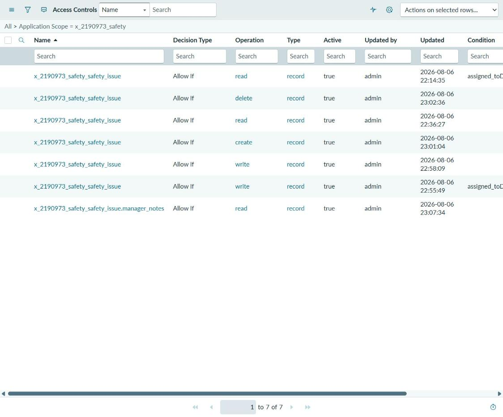
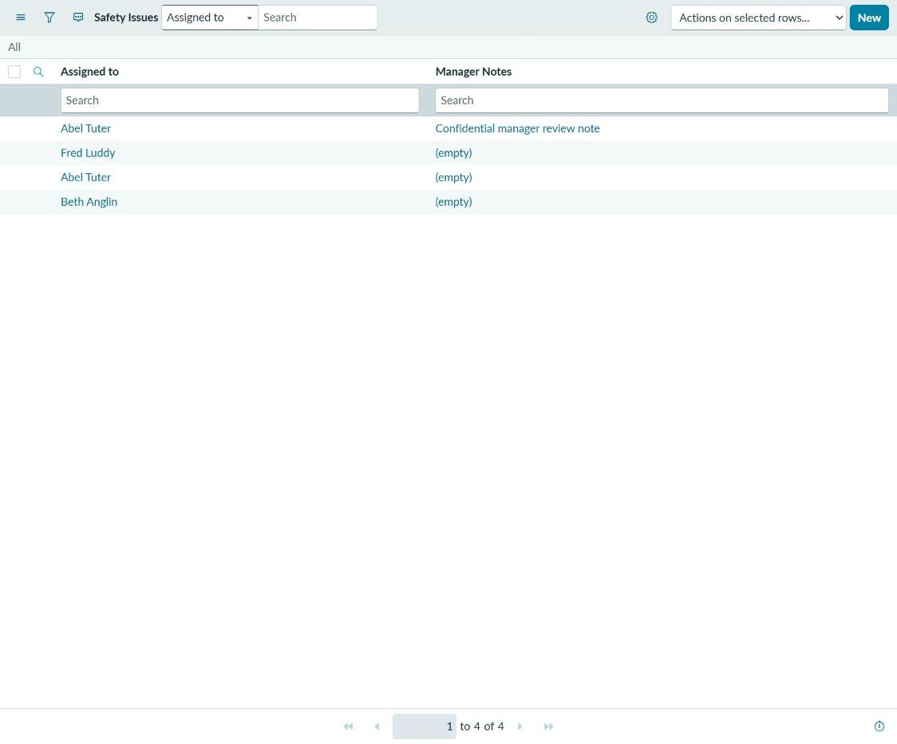
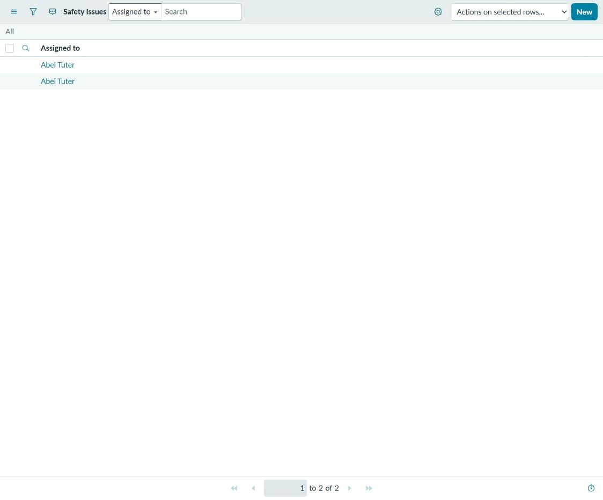

# Safety Issue Tracking: A Scoped ServiceNow Application

A custom scoped application built in ServiceNow App Engine Studio, demonstrating
table design, a role-based security model with row-level and field-level access
control, and form and list configuration.

**Built:** 2026-08-06 | **Packaged:** 2026-08-11 | **Version:** 1.0.0
**Scope:** `x_2190973_safety` | **Platform:** ServiceNow Zurich, Personal Developer Instance

**[Open the access control simulator](https://dustinford02.github.io/servicenow-safety-app/demo/)**,
a browser-based model of the seven rules described below. No instance, no sign-in.

---

## Scope of this work, stated plainly

This is self-directed laboratory work built in a Personal Developer Instance, not a
production deployment and not client work. It is one artifact from ongoing study
toward the Certified System Administrator credential, alongside ServiceNow
University coursework. It is not evidence of production administration experience
and is not presented as such.

Where this README describes a design decision, the decision was mine and I can
explain the alternatives I rejected; where it describes a limitation, the limitation
is real and I have not papered over it. A portfolio that overstates its own scope is
worth less than one that does not.

---

## What the application does

Safety Issue tracking. A user reports a safety issue, the issue is assigned to
someone, and a manager can attach notes that the reporting user cannot see. The
functional surface is deliberately small. The interesting work is in the security
model underneath it.

## What it demonstrates

| Competency | Where to look |
|:--|:--|
| Scoped application design | `x_2190973_safety` namespace, application menu, modules |
| Custom table creation | `x_2190973_safety_safety_issue` |
| Field design including reference fields | `assigned_to` (reference to `sys_user`), `manager_notes` |
| Role definition | `x_2190973_safety.user`, `x_2190973_safety.admin` |
| Per-operation access control | 7 ACLs covering create, read, write, delete |
| Row-level security | Dynamic condition restricting users to their own records |
| Field-level access control | `manager_notes` readable only by the admin role |
| Form and list configuration | Form layout and list layout records |
| Application packaging | Published to a named, exportable update set |

---

## The security model

This is the part I would want to be asked about.

The application defines two roles. `x_2190973_safety.user` is the ordinary
participant. `x_2190973_safety.admin` is the manager. Seven access controls
distribute permissions between them.

### Access controls, as built

| # | Operation | Target | Granted to | Condition |
|--:|:--|:--|:--|:--|
| 1 | create | table | user **and** admin | none |
| 2 | read | table | user | assigned to the current user |
| 3 | read | table | admin | none |
| 4 | write | table | user | assigned to the current user |
| 5 | write | table | admin | none |
| 6 | delete | table | admin | none |
| 7 | read | `manager_notes` field | admin | none |



*Two rows carry a condition restricting rows to the current user. The seventh row is the
field-level rule on `manager_notes`.*

**The same list, as two different roles.**

| As administrator | As `x_2190973_safety.user` |
|:--|:--|
|  |  |

Left: signed in as administrator, all four records, `Manager Notes` visible. Right: the
identical list while impersonating a demo user holding only `x_2190973_safety.user`. Two
records instead of four, and the `Manager Notes` column is not merely blank, it is not
present. That is rules 2, 4, and 7 running, not asserted.

**[Try it interactively](demo/index.html).** A client-side simulator of these same
seven rules, running as JavaScript in your browser with no ServiceNow platform behind
it. Switch between four roles, including a platform administrator, and watch which
rule grants or denies each operation, field access included. It reimplements the
access controls for demonstration; the update set XML below remains the authoritative
artifact.

### Why it is built this way

**Each operation gets its own rule.** Create, read, write, and delete are four
distinct operations in ServiceNow's access control model, and a requirement like
"users may see this but only managers may change it" cannot be expressed in a
single rule. Rules 2 and 4 versus rules 3 and 5 are that requirement made concrete.

**Row-level security comes from a condition, not a script.** Rules 2 and 4 carry a
dynamic condition evaluating `assigned_to` against the current user. An ordinary
user therefore sees and edits only the issues assigned to them, while an
administrator sees everything. This is a declarative condition rather than a
scripted ACL, which is the right default: it is readable by someone who does not
write JavaScript, and it survives upgrades without review.

**Field-level control requires table-level control first.** Rule 7 restricts the
`manager_notes` field to administrators. This rule is only meaningful because rules
2 and 3 already grant table-level read access. ServiceNow evaluates table-level
access controls before field-level ones, so a permissive field rule sitting behind
a table that grants nothing would never be reached. Getting this ordering wrong is
the single most common access-control mistake I have seen described, and rule 7 is
where I proved to myself that I understood it.

**One rule was created and then deleted.** The update history shows a field-level
access control that I built and then removed. That was not tidying. It was the
result of testing the evaluation order above and finding that the rule I had first
written was not doing what I assumed. The deletion is the honest record of that,
and I would rather leave it visible than clean it out of the history.

---

## Repository contents

```
.
├── README.md                          You are here
├── LICENSE                            MIT
├── CITATION.cff                       How to cite this application
├── .github/
│   └── workflows/
│       ├── acl-audit.yml              Re-audits the packaged access controls
│       └── doc-drift.yml              Re-checks this README against the repository
├── demo/
│   └── index.html                     Interactive access control simulator
├── docs/
│   ├── DESIGN_RATIONALE.md            Decisions made and alternatives rejected
│   └── SCREENSHOT_GUIDE.md            What to capture and how to redact it
├── screenshots/                       Referenced from this README
│   ├── 04-access-controls-list.png
│   ├── 07-list-as-admin.png
│   └── 08-list-as-user.png
├── tools/
│   ├── acl_audit.py                   Checker behind the ACL audit workflow
│   └── doc_drift.py                   Checker behind the documentation drift workflow
└── update-set/
    └── Safety_v1.0.0_update_set.xml   Complete, importable application
```

- **[Design rationale](https://github.com/dustinford02/servicenow-safety-app/blob/main/docs/DESIGN_RATIONALE.md)**: every decision made, the alternatives considered, and where the argument cuts against me.
- **[Screenshot guide](https://github.com/dustinford02/servicenow-safety-app/blob/main/docs/SCREENSHOT_GUIDE.md)**: the shot list and redaction rules used to produce the screenshots below.
- **[Update set XML](https://github.com/dustinford02/servicenow-safety-app/blob/main/update-set/Safety_v1.0.0_update_set.xml)**: the complete, importable application.

Two scheduled checks run against this repository rather than against an instance. One
re-parses the packaged update set and re-audits the seven access controls. The other
compares the file tree and the links in this README against what is actually
committed, so a claim in this file cannot quietly outlive the file it describes.

## Installing this application

The update set XML is a complete package: table, fields, roles, access controls,
form and list layouts, application menu and modules, plus four sample records.

1. In a target instance, go to **Retrieved Update Sets**.
2. Choose **Import Update Set from XML** and upload
   `update-set/Safety_v1.0.0_update_set.xml`.
3. Open the retrieved set and **Preview** it. Resolve any collisions.
4. **Commit** the update set.
5. Grant a test user `x_2190973_safety.user` and impersonate them to see the
   row-level and field-level rules take effect.

Step 5 is the one worth doing. The security model is invisible as an administrator,
because administrators bypass it.

## Verification

The packaged update set contains 36 configuration records:

| Type | Count |
|:--|--:|
| Access Roles | 10 |
| Access Control | 7 |
| Field Label | 3 |
| Dictionary | 3 |
| Application Menu | 2 |
| Role | 2 |
| Module | 2 |
| Embedded Help Role Priority | 2 |
| Table | 1 |
| Custom Application | 1 |
| Form Layout | 1 |
| List Layout | 1 |
| Table Subscription Configuration | 1 |

The XML parses cleanly and contains no instance URL, credential, or personal data.

---

## Honest limitations

- **No flow automation.** There is no Flow Designer flow. Issues are assigned
  manually. Approval routing would be the natural next addition.
- **No business rules or client scripts.** All behavior is declarative. That is a
  defensible choice for an application this size, but it means this repository does
  not demonstrate server-side or client-side scripting.
- **No integration.** Nothing here calls or is called by an external system.
- **The table is standalone.** See the
  [design rationale](https://github.com/dustinford02/servicenow-safety-app/blob/main/docs/DESIGN_RATIONALE.md)
  for why, and for the argument against that choice.
- **Four sample records.** Enough to demonstrate the access rules, not enough to
  demonstrate anything about scale.
- **Built in a single working session.** The timestamps say so and I am not going
  to pretend otherwise.

## License

MIT. See [LICENSE](https://github.com/dustinford02/servicenow-safety-app/blob/main/LICENSE).
The update set is yours to import, inspect, and modify.
